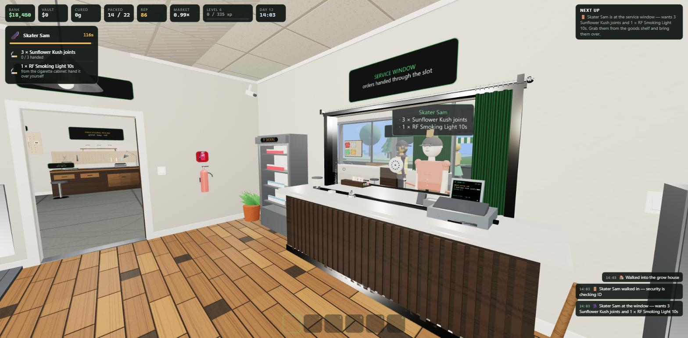
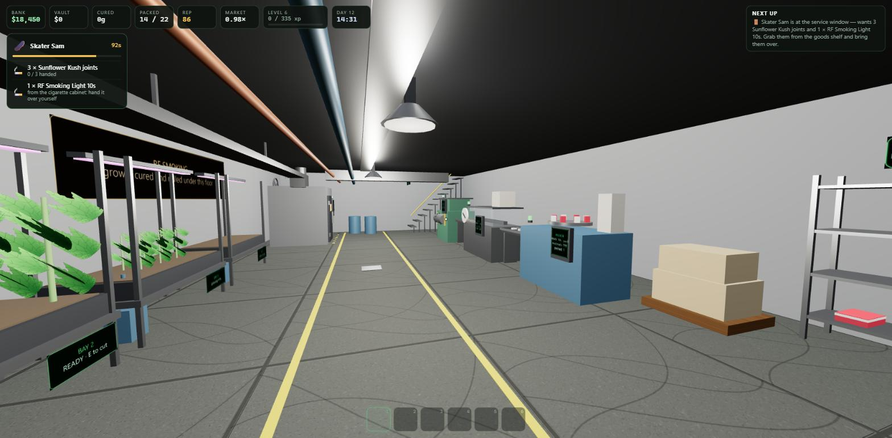
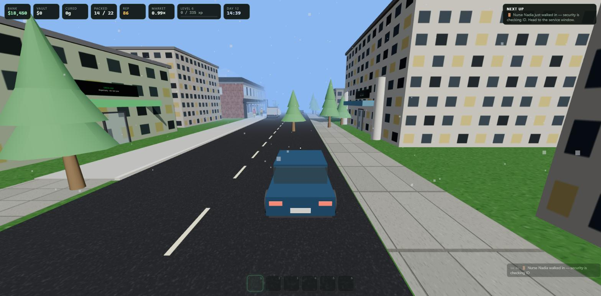

<p align="center"></p>

<p align="center"><b>A first-person shop simulator.</b><br>Grow it, cure it, pack it, sell it through the window. Then build a cigarette works in the basement, fight off robbers, and drive around a small open town.</p>

<p align="center">
  <a href="https://github.com/TheCodingDad-TisonK/Grow-Co/releases/latest"><b>Download for Windows</b></a> ·
  <a href="https://github.com/TheCodingDad-TisonK/Grow-Co/wiki"><b>Wiki</b></a> ·
  <a href="https://discord.gg/8FcgxwJ3dM"><b>Discord</b></a> ·
  <a href="https://realisticfarming.com"><b>realisticfarming.com</b></a>
</p>

> [!IMPORTANT]
> **This is NOT a Farming Simulator product.**
> Grow Co. has nothing to do with Farming Simulator, GIANTS Software, or any Farming Simulator mod, including the Realistic Farming mods by the same author. It is not a mod, not an add-on, not part of that suite, and it is not affiliated with or endorsed by GIANTS Software.
> It is a separate, standalone hobby project that came alive for one reason: its author enjoyed building it.



## What it is

You run a small dispensary and serve every customer at the window. Everything is physical: you carry soil to the tent, hang the harvest on the drying line, carry jars to the workbench, take goods off the shelf and hand them over yourself. The shop grows from $220, one tent and one pot into a business with staff, licences, a basement factory, a lab, a car, a shop van and a second branch.

It's one HTML page and plain JavaScript on top of [three.js](https://threejs.org). No build step, no framework, no assets to download: every texture and sound is generated in code. The desktop app is the same page inside Electron.

## Features

| | |
|---|---|
| **The loop** | Order supplies, grow in tents, water, feed, fight pests and mould, harvest, dry, cure, grind, bag, roll, bake, sell. Quality and strain matter. |
| **The shop** | The window with real orders, cash with change or card, tips, a vault, a bank courier, markup, curtains, lights, radio, dust and a broom, a bin to empty and a water cooler. |
| **Staff** | A crew of up to three (Jo, Mika and Sam) who serve, restock, sweep and tend plants, the guard on the door, and a driver, a basement operator and a night guard off the staff roster. The crew and the guard can be sent home for the day. |
| **RF Smoking** | A pre-installed basement line: hydroponic tobacco bays, curing kiln, shredder, cigarette maker (normal or light), packer (10s or 20s). Packs sell from a shuttered cabinet, handed over by you. |
| **Extraction lab** | Turns bud of any quality into vape carts, pressed hash, gummies and chocolate. |
| **Robberies** | Four kinds of robber in six stages, from casing the lobby to a getaway car you can ram. Bat, pepper spray, taser, pistol, shotgun, a firearms licence, a silent alarm, lockable doors, and consequences for bad shots. |
| **The town** | A street grid with traffic, a bank and a gun store you walk into, a supplier, a wholesaler, a rival you can buy out, a park for street deals, a police precinct and a heat system. Press M for the map. |
| **Two vehicles** | The car lives in the garage and the van in the bay under the canopy, behind a yard gate that opens for you and a lane barrier that lifts as you drive up. Haul supplies and cartons, run deliveries, fit upgrades. |
| **The shop van** | Shift+E on the hatch opens it up. Stock its rack with three joints, three bags and three cookies, take the window, and sell to passers-by at half again the shop price. Now and then one is plain-clothes police. |
| **Upstairs** | Your own flat, a connoisseur lounge with its own staircase from the lobby, and a roof greenhouse. |
| **Make it yours** | F2 moves every piece of furniture, every sign and every wall screen. F3 is a full creative build mode. |
| **Guided intro** | A new shop is walked from its first order to its first sale in nine steps. Finish them for a $1,200 bonus, or switch it off in the pause menu. |
| **Keys and locks** | A keyring in the office. Shift+E locks any door, the goods shelf, the cigarette cabinet or the weapon locker. Locked stock survives a robbery. Your crew and the guard carry keys and lock up behind them. |
| **Three save slots** | Three shops, side by side, each deleted on its own. |
| **Bug reports** | F7 opens a form that gathers your version, system and savegame and files a labelled GitHub issue. |
| **Living world** | Day and night, seasons, rain, storms and snow, weekends, a holiday week, power cuts and a generator. |




## Install and play

**Windows, the easy way.** Download `Grow-Co-Setup-x.y.z.exe` from the [latest release](https://github.com/TheCodingDad-TisonK/Grow-Co/releases/latest) and run it. It installs for your user, adds Desktop and Start menu shortcuts and starts the game. Windows may show a SmartScreen notice because the installer isn't code signed. Choose "More info", then "Run anyway".

**From source, any platform.**

```bash
git clone https://github.com/TheCodingDad-TisonK/Grow-Co.git
cd Grow-Co
npm install
npm start            # the desktop app
npm run serve        # or play in a browser at http://127.0.0.1:8420/
```

The game needs no server logic. Anything that can serve the `game/` folder as static files can host it.

## Controls

`WASD` move · `Shift` run · `Space` jump · `Ctrl` crouch · `E` use, pick up, hand over · `Shift+E` second action · `Ctrl+E` send a crew member home · `G` put back · `1 to 6` hotbar · `Tab` inventory · `M` map · `J` deliveries · `P` silent alarm · `F2` edit mode · `F3` creative mode · right-click closes menus · `F7` report a bug · `Esc` pause · `F11` fullscreen

The main menu has a guide of 21 chapters, including an "I am stuck" chapter. The same guide is in the [wiki](https://github.com/TheCodingDad-TisonK/Grow-Co/wiki/Player-Guide).

## Repository layout

```
game/                 the whole game: static files, playable from any web server
  index.html          page, HUD and overlays
  grow3d.js           the simulation and the world (one file, one closure)
  grow3d-creative.js  creative build mode, plugged in through RFGROW.hooks
  guide.js            the player guide (main menu, pause menu and wiki share it)
  report.js           the bug report form (F7)
  menu.js, menu.css   splash screen and main menu
  vendor/three/       three.js r128 (MIT)
main.js               Electron shell
tools/                static server, icon builder, guide exporter, release zip
docs/                 the wiki source; pushed to the GitHub wiki by a workflow
screenshots/
```

## Documentation

Everything lives in [`docs/`](docs) and is mirrored to the [wiki](https://github.com/TheCodingDad-TisonK/Grow-Co/wiki) on every push to `main`.

- [Getting started](docs/Getting-Started.md)
- [Player guide](docs/Player-Guide.md)
- [Architecture](docs/Architecture.md): how one file holds a whole game, and how to find your way in it
- [Systems reference](docs/Systems-Reference.md): every system, its state and its entry points
- [Modding guide](docs/Modding-Guide.md): add a prop, a machine, a place in town, a product, a robber
- [Save format](docs/Save-Format.md)
- [Building and releasing](docs/Building-and-Releasing.md)
- [Roadmap and ideas](docs/Roadmap-and-Ideas.md)
- [Reporting bugs](docs/Reporting-Bugs.md)
- [FAQ](docs/FAQ.md)
- [House style](docs/House-Style.md): how the game is written, and the word list

## Make it your own

Fork it. The [modding guide](docs/Modding-Guide.md) walks through the patterns the game already uses, so a new machine or a new shop in town is mostly a matter of copying a neighbour. There is a developer menu in the pause screen with teleports, spawners and fillers for testing, and `window.RFGROW` exposes the running game in the console.

## Credits

A game by **TheCodingDad**, who also makes the Realistic Farming mods for Farming Simulator. This game is a separate hobby project and has nothing to do with those mods or with Farming Simulator; the website and Discord links are simply where to find the author. Built on [three.js](https://threejs.org) (MIT) and [Electron](https://www.electronjs.org) (MIT).

## License

[MIT](LICENSE). Do what you like with it. Keep the notice.
