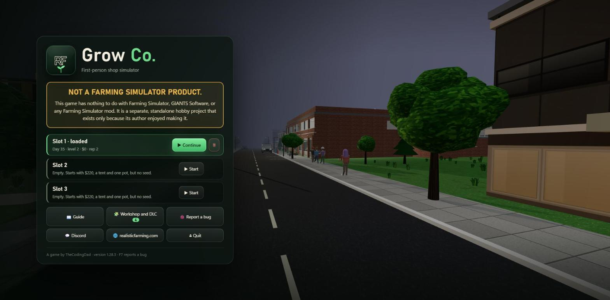
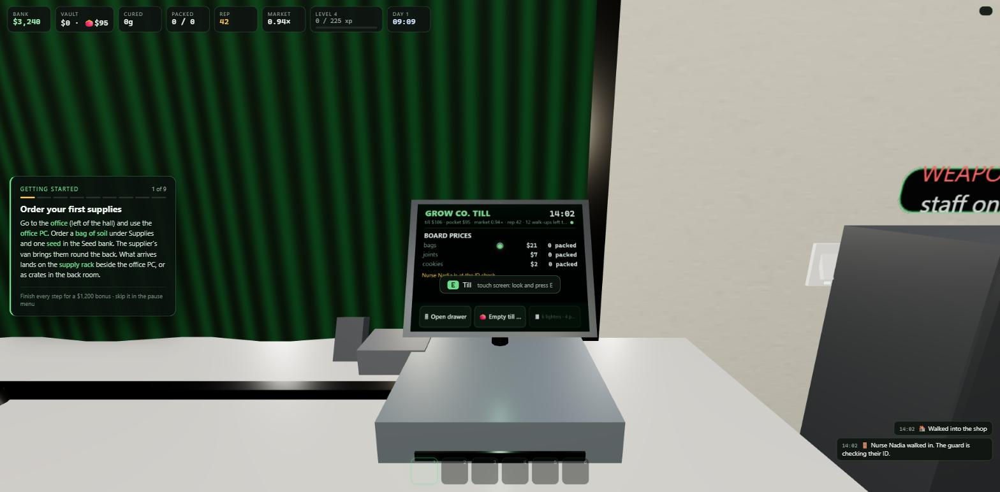
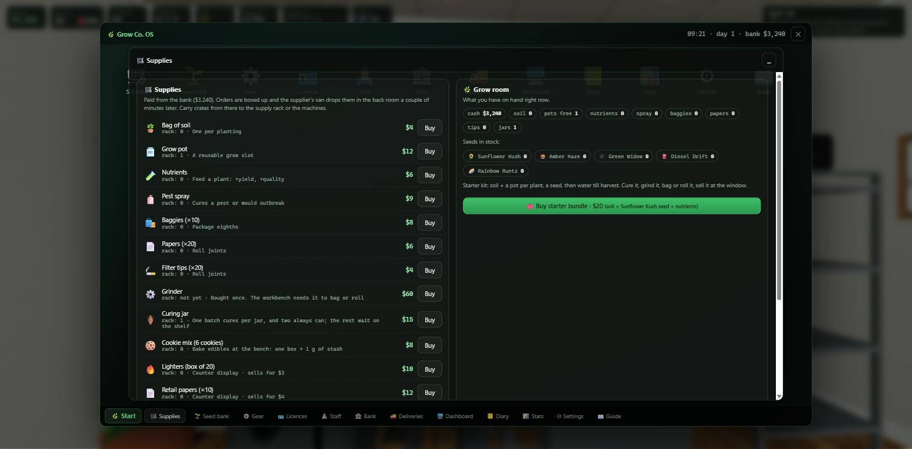
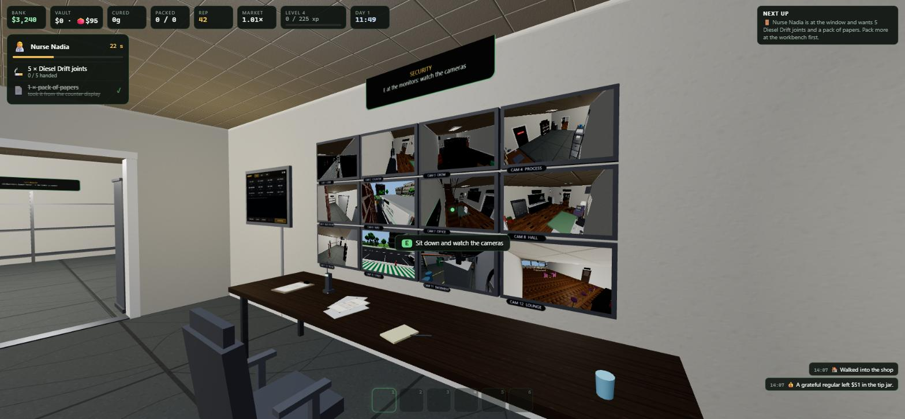
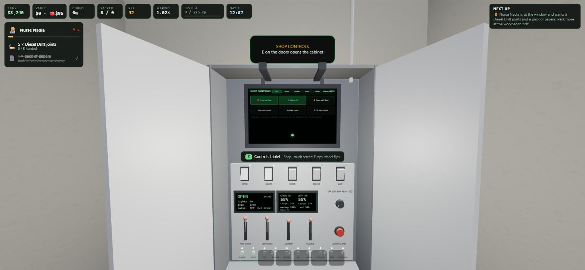
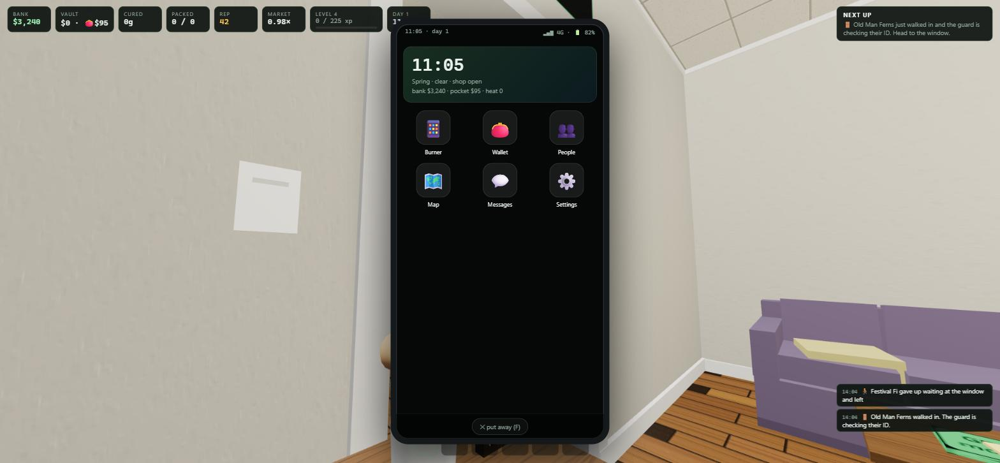
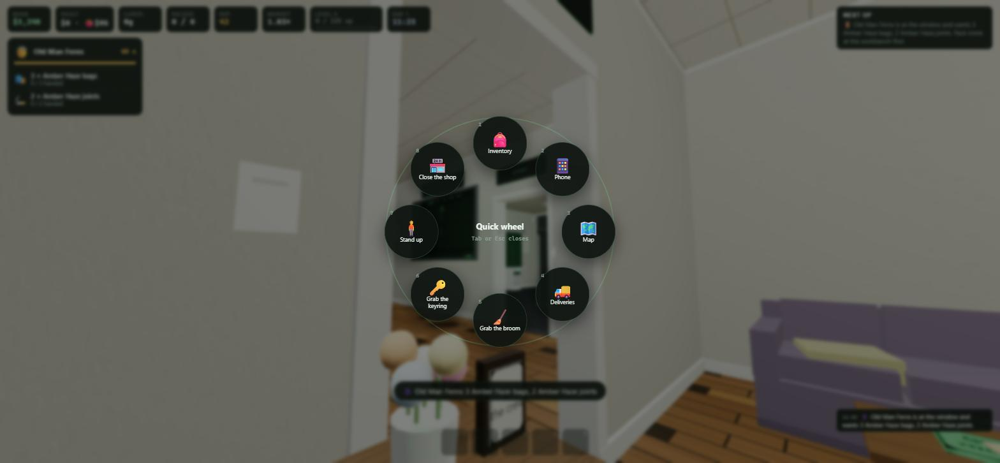
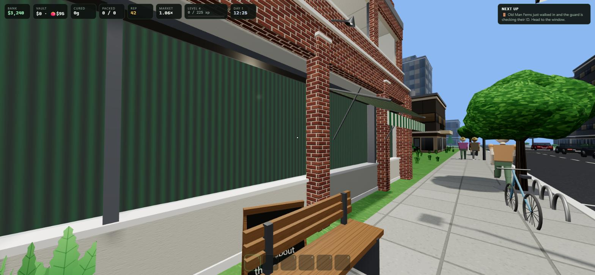

# Grow Co. gallery

Screenshots from the game. Back to the [main README](../README.md).

| | |
|---|---|
|  |  |
| The till is a tablet above the cash drawer | The office PC and its apps |
|  |  |
| The security room: camera feeds and the wall tablet | The control cabinet: a tablet, switches, levers and displays |
|  |  |
| Your phone, on F | The quick wheel on Tab |
|  |  |
| The street outside |  |
